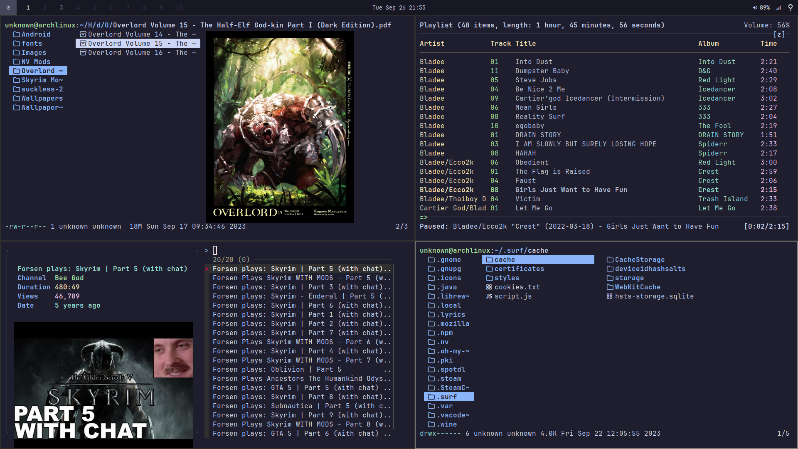
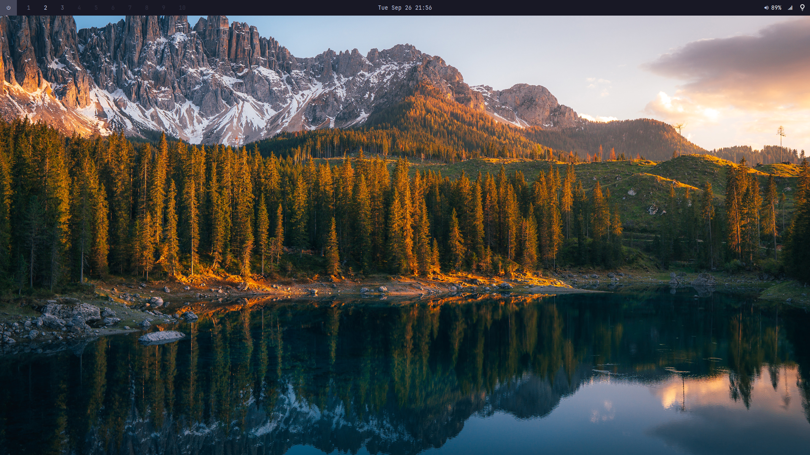
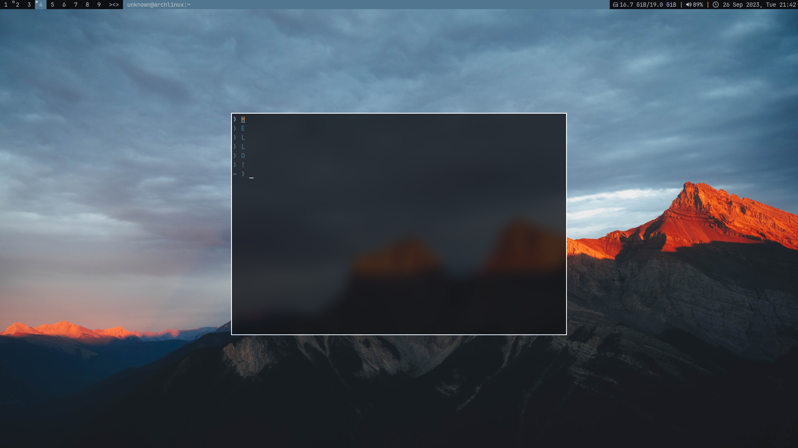

# dotfiles

# v1:

Consists of a bunch of little things I got from other peoples configs, most noticeably from the famous linux youtuber Eric Murphy.

- bspwm
- rofi
- alacritty
- polybar

# v2:

My current setup using suckless software.

[Pre-patched files](https://github.com/caiohenrique-3/suckless-dotfiles)

- dwm
- dmenu
- st
- slstatus
